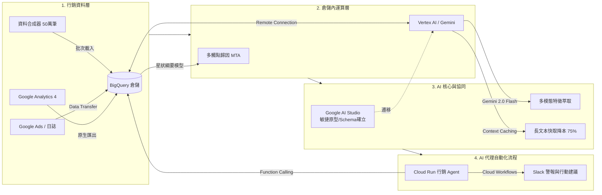

# Day 02 | 技術評估：為何選 Google Cloud + Vertex AI？從生態整合到成本效益的深度剖析

## 1. 前言：現代 MarTech 架構的技術評估痛點

在建構 AI 驅動的行銷科技（MarTech）架構時，多數團隊常陷入「拼裝車困境」：

- **跨平台搬遷成本**：資料儲存在資料倉儲 A，呼叫雲端廠商 B 的模型 API，再把特徵向量存入向量資料庫 C。每一次的跨網路資料傳輸，伴隨的都是延遲增加、資料傳輸費用與個資外洩的潛在風險。
- **膠水程式碼膨脹**：為了把未加工的廣告日誌餵給 LLM，工程團隊必須撰寫大量中繼腳本處理驗證、重試、快取與限流，維運負擔沉重。

本專案的核心目標是打造**端對端的全自動廣告歸因與多模態素材分析系統**。在評估整體架構時，我們的最高原則是：**「資料在哪裡，運算就在哪裡」**。本文將從生態整合、倉儲原生 AI、多模態特徵工程與 FinOps 成本控制四個維度，深入剖析為何選擇 Google Cloud 與 Vertex AI 作為核心技術組合。

---

## 2. 三大雲端平台 AI 技術橫向評估

針對行銷數據歸因與多模態圖文分析的複合需求，我們橫向比較了 Google Cloud、AWS 與 Microsoft Azure 的技術特性：

| 評估維度 | Google Cloud (Vertex AI + BigQuery) | AWS (Bedrock + SageMaker + Redshift) | Azure (Azure OpenAI + Microsoft Fabric) |
| :--- | :--- | :--- | :--- |
| **核心殺手級優勢** | **數據與 AI 物理融合**：GA4/Ads 原生直連、BigQuery 內以 SQL 直接驅動 Gemini、超長 Context Caching 降本 75% | **模型多元化與成熟 MLOps**：Bedrock 單一 API 聚合 Claude 3.5、Llama 3、Mistral 等頂尖模型；SageMaker 工具鏈最為成熟 | **OpenAI 生態與企業 SaaS 協同**：獨家企業級 GPT-4o / o1 存取保證；深度整合 Microsoft 365、Teams、Power Platform |
| **行銷生態原生整合** | **原生支援**：GA4 與 Google Ads 內建免費 BigQuery Export，日誌零延遲匯入 | **需依賴中繼**：需使用 AppFlow、第三方 ETL（如 Fivetran）或自建管線寫入 S3 | **需依賴管線**：需透過 Azure Data Factory 或 API 排程寫入 OneLake / Fabric |
| **倉儲內 SQL 呼叫 AI** | **原生 SQL 呼叫**：`ML.GENERATE_TEXT` 原生內嵌，分析師無需跳出 SQL 即可診斷 | **Redshift ML 支援**：支援呼叫 SageMaker 模型，但需額外維護端點與權限 | **Fabric Copilot**：內建 Copilot 輔助分析，但對複雜自訂 Prompt 批次日誌處理的彈性稍不同 |
| **多模態特徵結構化解析** | **Gemini 原生強項**：百萬級 Token 上下文視窗能同時處理高解析素材，原生 JSON Schema 強制輸出穩定 | **多模型可選**：可選用 Claude 3.5 Sonnet（業界頂尖多模態與程式碼推理），靈活性極高 | **GPT-4o Vision 支援**：多模態識別精準度極高，唯大批次處理長上下文與高解析圖文時費用需審慎評估 |
| **長上下文視窗與快取經濟性** | **百萬級 Token + Context Caching**：日誌與素材特徵快取後享 75% 費用減免，大幅降低批次分析成本 | **Prompt Cache 支援**：Anthropic 支援快取，但窗口容量與雲端倉儲整合度相對受限 | **暫無原生大規模長上下文快取**：多輪對話與大批次素材分析計費成本較高 |
| **開源重現與開發環境** | **Cloud Shell 零配置**：免費提供預載 gcloud、terraform、docker 的 5GB 永久環境 | **CloudShell 規格有限**：儲存空間較小且預載工具鏈需額外手動配置 | **Cloud Shell 需綁定儲存**：需額外建立儲存體帳戶與設定計費資源 |
| **最佳適用場景** | **以 Google 數據生態為核心的 MarTech、大樣本日誌歸因、需兼顧極致 FinOps 預算防爆者** | **追求避免單一廠商鎖定、重度自訂模型訓練與微調之大型架構** | **企業內部系統高度綁定微軟生態、需開發員工內部助理（Teams/SharePoint）、強烈依賴 OpenAI 旗艦模型者** |

### 雲端平台沒有絕對優劣，只有場景適配

如果跳脫本專案的特定邊界，三大雲端平台在生成式 AI 的佈局各具頂尖優勢：

1. **AWS（Amazon Bedrock + SageMaker + Redshift）—— 模型多樣性與靈活架構的王牌：**
   - 優勢：AWS Bedrock 的核心哲學是「不把雞蛋放在同一個籃子裡」。透過單一 API，企業能自由在 Anthropic Claude 3.5（業界公認程式碼與邏輯推理標竿）、Meta Llama 3、Mistral 等開源與閉源模型間切換，徹底避免單一供應商鎖定。同時，SageMaker 在模型微調、分散式訓練與 MLOps 維運上，依然是業界成熟度最高的老牌標竿。
   - 何時選它：如果專案的核心需求是構建跨模型比對系統、需要深度自訂訓練自有權重模型，或企業原本的海量資料就沉澱在 Amazon S3，AWS 無疑是最佳選擇。

2. **Microsoft Azure —— 企業級商務協同與 OpenAI 旗艦推理的重鎮：**
   - 優勢：微軟與 OpenAI 的深度結盟，讓 Azure OpenAI Service 成為使用 GPT-4o、o1 推理模型最具企業合規保障（含專屬輸送量 PTU、私有端點）的平台。更關鍵的是它與微軟企業生態的無縫共振——無論是 Teams、Microsoft 365、Dynamics 365 還是 Power Platform，Azure 都能做到「點擊即整合」。
   - 何時選它：如果系統的主要任務是打造企業內部知識庫、串接 Office 辦公套件或 CRM 流程，或是業務邏輯非 OpenAI 旗艦推理模型不可，Azure 具有壓倒性的商務協同優勢。

3. **Google Cloud —— 資料重力（Data Gravity）與行銷場景的最佳解：**
   - 專案歸因：回到本專案的命題《AI-Driven MarTech》，我們的核心資料源是 GA4 與跨通路廣告日誌。Google 在行銷數據鏈路上擁有天然的「數據重力」——GA4 原生免費直灌 BigQuery，省去了昂貴且脆弱的第三方 ETL 管線。
   - 運算閉環：BigQuery 的 `ML.GENERATE_TEXT` 實現了「運算向數據靠攏」，讓我們能在百萬筆成效日誌所在的倉儲內，直接用 SQL 完成多模態診斷；再搭配 Gemini 百萬字元的 Context Caching，將分析成本壓低 75%。這不是「Google 贏了全世界」，而是在「行銷數據分析 × 雲端原生運算 × 嚴密成本控管」這個交集點上，Google Cloud 展現出最高的整合效益與投資報酬率（ROI）。

從評估結果可看出，在處理以 GA4 與數位廣告日誌為核心的 MarTech 場景時，Google Cloud 提供了阻力最小的端對端整合路徑。

---

## 3. Google AI 內部雙軌協同：Google AI Studio vs. Vertex AI

許多開發者在切入 Google AI 技術組合時，常有疑問：「既然 Google AI Studio 提供了免費且快速的 Web 介面與 API Key，為什麼正式架構必須採用 Vertex AI？」

在本作的架構設計中，兩者並非互相排斥，而是各司其職的**雙軌協同關係**：

```text
[敏捷原型軌]
Google AI Studio (Web UI & Prototyping)
  ├── 快速驗證 Prompt 提示詞
  ├── System Instructions 效果調整
  └── 確定 Structured Outputs JSON Schema
           │
           ▼ (轉換遷移)
[生產落地軌]
Vertex AI on Google Cloud (Enterprise Production)
  ├── IAM 角色與 Service Account 精細權限驗證
  ├── BigQuery Remote Connection 內網互通
  ├── 企業級 SLA、配額管理與 VPC Service Controls
  └── Vertex AI Model Evaluation 品質度量
```

值得一提的是，一般使用者在 Gemini Web Chat 介面中看到的滾動更新（如 3.8 Flash、3.5 Flash-Lite、3.1 Pro），屬於面向終端消費者的 SaaS 應用層；而在企業架構與 Vertex AI 中，Google 提供嚴格的版本生命週期與端點管理。本專案以成熟穩定的 Gemini 2.0 世代為核心基準，並透過 Google Gen AI SDK 的標準介面，具備無縫升級至新一代 3 系列的擴充彈性。

- **Google AI Studio（敏捷原型軌）**：負責「實驗與探勘」。在 Day 13–15 設計廣告圖文特徵萃取提示詞時，我們會在 AI Studio 進行小樣本盲測，迅速調校色系、排版、主標題情緒等萃取規格。
- **Vertex AI（生產落地軌）**：負責「自動化與治理」。當 Prompt 規格定型後，程式碼透過 Google Cloud 統一的 `google-cloud-aiplatform` SDK 呼叫，全面享受 IAM 權限控管、稽核日誌與零外部網路傳輸的安全保障。

---

## 4. 資料與 AI 的物理融合：BigQuery 零搬遷直連架構

傳統上將 AI 引入資料分析的架構如下：

```text
[傳統模式] BigQuery ──(匯出 CSV/Pandas)──> 應用伺服器 ──(外部 HTTP)──> LLM API ──(寫入結果)──> 資料庫
```

這種做法存在三大致命傷：記憶體瓶頸、網路逾時、API 速率限制。

而在 Google Cloud 原生體系中，我們採用**倉儲內就地運算（In-Warehouse Execution）**：

```text
[零搬遷模式]
BigQuery (廣告成效星狀綱要)
   │
   ├── (Cloud Resource Connection)
   ▼
Vertex AI (Gemini 2.0 Flash / Pro)
```

透過建立 BigQuery 與 Vertex AI 的遠端連線，分析人員只需撰寫一段標準 SQL：

```sql
SELECT
  campaign_id,
  roas_gap,
  ml_generate_text_result['candidates'][0]['content']['parts'][0]['text'] AS ai_diagnosis
FROM
  ML.GENERATE_TEXT(
    MODEL `martech_dw.gemini_2_flash_model`,
    TABLE `martech_dw.v_abnormal_campaigns`,
    STRUCT(
      0.2 AS temperature,
      1024 AS max_output_tokens,
      TRUE AS flatten_json_output
    )
  );
```

這代表著：**百萬行級別的廣告異常歸因與日誌診斷，完全在 Google 雲端骨幹網路內部完成**，大幅提升執行效能與安全性。

---

## 5. 系統架構與技術生態圖

整個技術組合與資料流架構如下：

[[Google Cloud + Vertex AI 原生行銷技術組合生態架構圖 (SVG)]](https://raw.githubusercontent.com/gminc/ai-driven-martech-pipeline/main/docs/images/day02-tech-stack-integration.svg)



---

## 6. FinOps 成本防護實踐：銅板價跑完企業級資料處理流程

對於跨足行銷與工程的實踐者來說，架構設計固然重要，但如何在追求效能的同時兼顧成本效益，往往才是專案能否順利落地的關鍵考量。  
本專案貫徹以下四層防爆機制：

1. **GCP Always Free 免費額度極大化**：
   - **BigQuery**：每月享有 10GB 儲存空間與 1TB 查詢額度，支撐 90 天 50 萬筆合成資料的日常查詢綽綽有餘。
   - **Cloud Run**：每月提供 200 萬次免費請求，足以承載行銷決策 Agent 與展示前台。
2. **模型分級配置（Flash / Flash-Lite 為主，按需呼叫）**：
   - 例行性、大批次的特徵擷取與格式化資料處理，優先採用 **Gemini 2.0 Flash** 或極致輕量版 **Gemini 3.5 Flash-Lite**。其不僅擁有極佳的首字回應時間（TTFT）與極高的推論速度，成本更僅為 Pro 模型的數分之一；同時原生支援嚴格的結構化輸出（Structured Outputs），確保資料處理管線的穩定性。
   - 僅在需要複雜邏輯推理、多步驟歸因診斷與 Agent 最終決策環節時，才按需呼叫 **Gemini 2.0 Pro** 或高階推理模型，精準發揮高階模型的推理優勢，達到最佳的成本效益比。
   - ⚠️ **警惕 Extended Thinking 的 Token 陷阱**：在 Web Chat 聊天室開啟延伸思考（Extended Thinking）屬於月費功能；但在雲端 API 計費中，模型自我推理與反思所產生的「Thinking Tokens」是全額按量收費的。若在數十萬筆的批次管線中貿然開啟深層思考，Token 消耗量將激增數倍，瞬間突破預算防線。因此在自動化資料管線中，務必鎖定標準推理或低思考強度。
3. **長上下文快取（Context Caching）技術實測**：
   - 在批次分析多通路日誌與大量素材規範時，將系統提示詞與星狀綱要快取於 GPU/TPU 記憶體中，**輸入 Token 成本直降 75%**，延遲顯著降低。
4. **硬性預算警報**：
   - 專案已建立 NT$ 300（US$ 10）的雲端預算警報（Alert ID: `6c09c1a7-6852-4f4f-82dd-c69cb4131ab2`），在 50%、80%、100% 門檻即時觸發通知，絕不產生未預期的雲端帳單。

> 💡 **工程思維亮點：避免過度架構化**  
> 在生成式 AI 爆發的時代，許多架構設計傾向導入大量複雜的開源封裝框架與外部向量資料庫。然而在企業實務中，過多的中繼依賴往往造成「除錯黑箱」與「套件版本衝突」。本專案堅持「雲原生精簡主義」——以 BigQuery 原生能力、Vertex AI SDK 與標準 Terraform IaC 為骨幹，去除冗餘抽象層，確保讀者與評審皆能以最高透明度完整重現。

---

## 7. 總結與明日預告

確立了以 Google Cloud + Vertex AI 為核心的技術評選後，我們已為接下來 28 天的實作奠定了堅實的地基。

**明日預告**：Day 03《環境基礎建設：Terraform 輕鬆建置 GCP 環境》，我們將正式開啟 Cloud Shell，用基礎設施即程式碼（IaC）一鍵配置 IAM、BigQuery Dataset 與預算警報，進入實戰動手階段！
